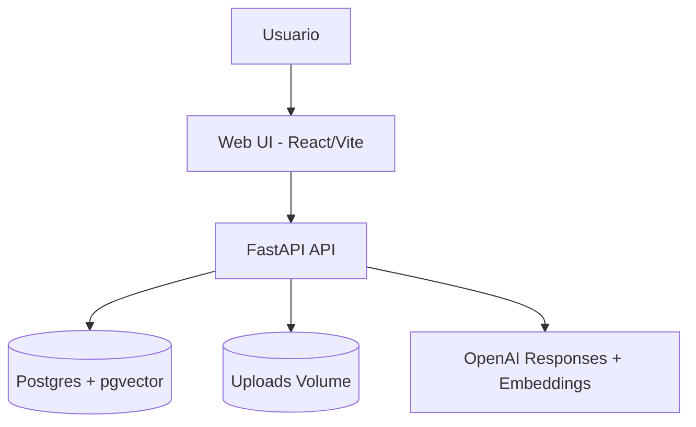

# Dimmel Knowledge Hub — Architecture

## Overview

## Key decisions

- **Vector store:** pgvector sobre Postgres para evitar otro servicio y mantener una base única. Esto simplifica el despliegue en Docker Compose y permite consultas con permisos en la misma base. Para MVP es estable y suficiente.
- **RAG híbrido:** se combinan coincidencias por keyword (ILIKE) y similitud vectorial en pgvector, filtrando por área permitida según rol.
- **Metadatos obligatorios:** se almacenan en tabla `documents` y se versionan marcando una versión vigente.
- **Servicios externos:** se deja un conector SAP/BEAS en modo mock con interfaz estable para futuras integraciones.

## Components

### Frontend (`/apps/web`)
- React + Vite.
- Páginas: Login, Biblioteca, Subida, Chat.
- Plantillas rápidas para consultas típicas.

### Backend (`/apps/api`)
- FastAPI con JWT.
- Ingesta de documentos y extracción de texto.
- Embeddings con OpenAI.
- RAG con citaciones.
- Auditoría en `query_logs`.

### Database
- Postgres con extensión pgvector.
- Tablas: `users`, `documents`, `document_chunks`, `chat_threads`, `chat_messages`, `query_logs`.

## RAG flow
1. Usuario hace pregunta.
2. Se filtran documentos por rol (área).
3. Se recuperan chunks por vector y keyword.
4. Se arma prompt con evidencia.
5. OpenAI genera respuesta y se devuelven fuentes.
